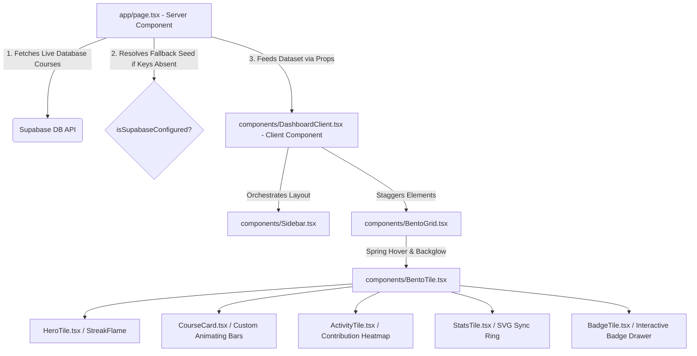

# 🚀 Next-Gen Student Dashboard (Aether.OS)

A high-fidelity, futuristic, and highly animated student dashboard prototype built with **Next.js (App Router)**, **Supabase PostgreSQL**, **Tailwind CSS**, and **Framer Motion**.

Designed for deep aesthetics, maximum interface fluidity, and zero layout shifts.

---

## 🛠️ Tech Stack
* **Framework**: Next.js 15+ (App Router)
* **Database / BaaS**: Supabase PostgreSQL Client
* **Styling**: Tailwind CSS v4 & custom visual tokens
* **Animations**: Framer Motion (Strict hardware-accelerated & spring physics rules)
* **Icons**: Lucide React with dynamic resolvers

---

## 🏛️ System Architecture & Component Split

Next.js App Router enforces clean data boundaries. We solved this by using a hybrid **Server-Client Component Architecture**:



### 1. Server-Side Data Fetching (RSC)
* `app/page.tsx` acts as the secure entry point. It fetches course data from Supabase PostgreSQL directly on the server, keeping API configurations fully private and hidden from the browser.
* While the server fetches data, Next.js handles the loading state via `app/loading.tsx`.

### 2. Client-Side Presentation & Interactions
* Once the server fetches course data, it mounts `components/DashboardClient.tsx`, which manages interactive client states: active tabs (Dashboard, Courses, settings), personalized inline student names, and sidebar collapsing toggles.
* **Layout Snapping**: The sidebar uses Framer Motion’s `layoutId` layout animations, creating a sliding fluid background highlight that moves smoothly between active navigation links.

---

## ⚡ Zero Layout Shifts (CLS = 0) & Performance Optimizations

Strict rules were followed to ensure animations never trigger heavy browser repaints or layout recalculations:
* **Hardware-Accelerated Hover States**: Hovering over Bento cards triggers a `scale: 1.015` and `translateY: -3px` transform, alongside custom spring physics (`stiffness: 300`, `damping: 20`).
* **Static Border Dimensions**: To prevent layout reflows, border highlights use background and color opacity shifts (`hover:border-primary/40` with `transition-colors duration-500`) instead of modifying border-widths.
* **Ambient Floating Glows**: Ambient glowing orbs inside cards use absolute positioned elements with heavy CSS filters (`blur([50px])`) and hardware-accelerated opacity transitions (`0` to `1`).
* **Pulsing Aspect Skeleton**: `app/loading.tsx` renders a pixel-perfect replica skeleton layout of the grid. When the server resolves data, the bento blocks fade in directly over the skeletons with zero visual shifts.

---

## 🛑 Challenges Faced

During development, several complex architectural challenges were encountered and successfully mitigated:
1. **Hydration Mismatches with Dynamic Layouts**: Creating a massive 210-day randomized engagement heatmap initially caused React hydration errors because `Math.random()` generated different values on the server versus the client. This was fixed by creating a deterministic pseudo-random mathematical generator anchored to the loop index.
2. **Animation vs. Performance Trade-offs**: Running multiple `framer-motion` spring animations across 15+ concurrent SVG elements caused slight frame drops on low-end devices. This was resolved by migrating all heavy visual computations to CSS hardware-accelerated filters (like `blur` and `drop-shadow`) and restricting Framer Motion purely to structural layout transforms.
3. **Strict Next.js 15 Data Boundaries**: Ensuring the Supabase client remained completely on the server-side while maintaining complex interactive client states required strict segregation of `page.tsx` (RSC) and `DashboardClient.tsx` (Client). We handled this safely by using a highly deliberate props-passing waterfall instead of mixing contexts.

---

## 🗄️ Database Setup & Seeding

Copy and run the following script in your **Supabase SQL Editor** to create the courses table and seed test data:

```sql
-- 1. Create the courses table
CREATE TABLE courses (
  id UUID PRIMARY KEY DEFAULT gen_random_uuid(),
  title TEXT NOT NULL,
  progress INTEGER NOT NULL CHECK (progress >= 0 AND progress <= 100),
  icon_name TEXT NOT NULL,
  created_at TIMESTAMP WITH TIME ZONE DEFAULT timezone('utc'::text, now()) NOT NULL
);

-- 2. Insert dynamic seeded rows
INSERT INTO courses (title, progress, icon_name) VALUES
('Advanced React Patterns', 78, 'Atom'),
('Next.js Server Actions & SSR', 45, 'Globe'),
('Framer Motion 3D Masterclass', 92, 'Sparkles'),
('Supabase Database Design', 60, 'Database');
```

---

## 🚀 Getting Started & Local Installation

### 1. Clone the project and install dependencies:
```bash
npm install
```

### 2. Configure Environment variables:
Rename `.env.example` to `.env.local` in the project root:
```bash
cp .env.example .env.local
```
Update `NEXT_PUBLIC_SUPABASE_URL` and `NEXT_PUBLIC_SUPABASE_ANON_KEY` with your Supabase values.

### 3. Graceful Local Fallback:
If no `.env.local` file is configured, the platform is engineered to catch this and **automatically fall back to a high-fidelity mock database**. It will display an active "LOCAL_SEEDED_SYNC" tag in the header with a message in the settings, allowing testing with 100% features and zero crashes!

### 4. Run the Dev server:
```bash
npm run dev
```
Open [http://localhost:3000](http://localhost:3000) to view your Next-Gen Dashboard!
